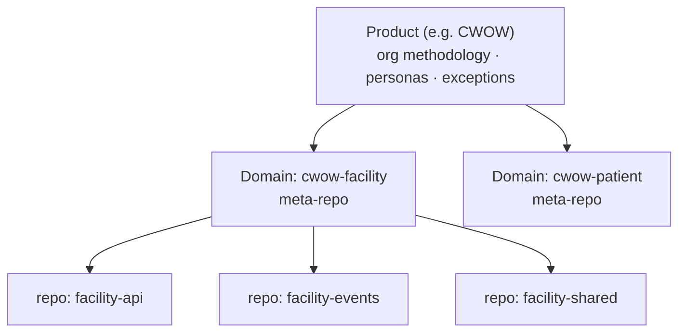
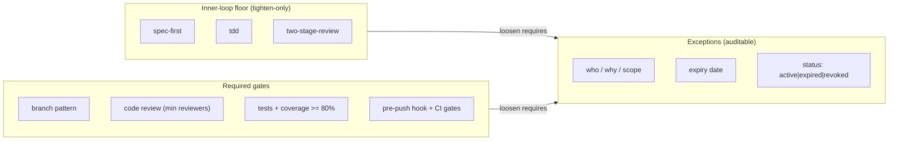
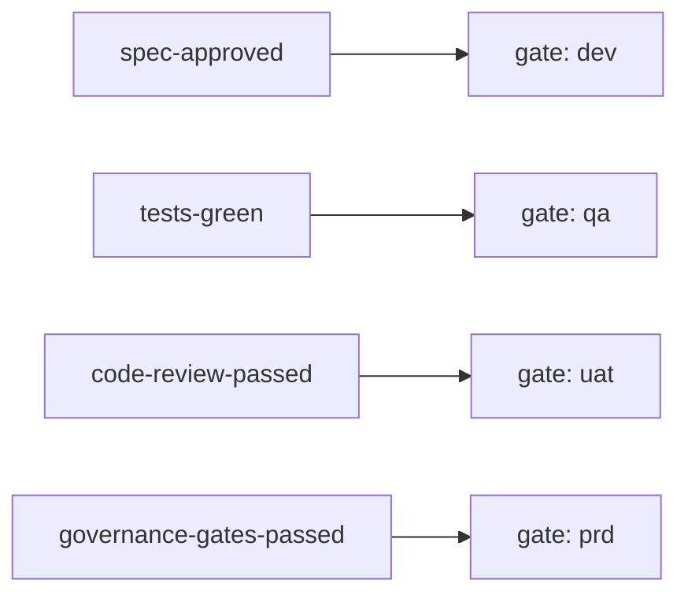
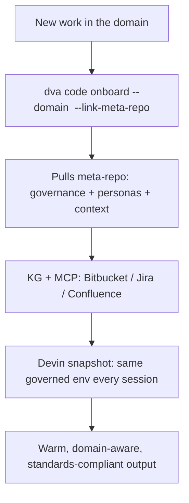
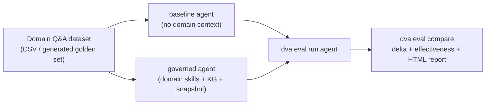

# Domain Onboarding & Governance — Demo Pack

**Audience:** Engineering leadership + platform stakeholders
**Purpose:** Show how the *domain onboarding* capability turns fragmented, multi-repo
development into a governed, context-rich, AI-ready experience — from one command.

**Contents**
1. [Exec Slide Outline](#part-1--exec-slide-outline) — ~11 slides, talking points + presenter notes
2. [Architecture One-Pager](#part-2--architecture-one-pager) — diagrams as a leave-behind

> Every claim below maps to shipped capability:
> `dva product create` / `dva domain create` / `dva domain init-meta` / `dva code onboard`,
> the meta-repo `.platform/config/governance.yaml` model, auto-generated persona skills,
> KG + MCP business-context wiring, and Devin snapshots for consistent agent sessions.

---

# Part 1 — Exec Slide Outline

> Format: one idea per slide. **Title** = what's on screen; bullets = what you say;
> _Presenter note_ = the transition / emphasis. Target 12–15 min + demo.

### Slide 1 — Title
**Governed Domain Onboarding: from repo sprawl to a single source of truth**
- Subtitle: *One command stands up a domain's context, standards, and AI environment.*
- _Presenter note: Open with the promise, not the architecture. "By the end you'll see a new domain — code, governance, and AI assistants — bootstrapped in minutes."_

### Slide 2 — The world today (the pain)
**Development is fragmented across modules**
- One domain = many repos (query / command / events / api / shared).
- Business context is scattered across Confluence, Jira, and people's heads.
- Standards (branch naming, review depth, test coverage, CI gates) drift per repo/team.
- Every new developer — and every AI assistant — starts **cold**.
- _Presenter note: This is the slide leadership feels. Name a recent incident/onboarding delay if you have one._

### Slide 3 — What that costs
**The hidden tax**
- **Slow onboarding** — days/weeks to become productive in a domain.
- **Inconsistent quality** — "best practices" live in wikis, not in mechanisms; drift is invisible until release.
- **Rework & risk** — cross-repo changes miss context; gaps surface late.
- **AI underdelivers** — assistants without domain context produce generic, low-trust output.
- _Presenter note: Pivot — "The root cause isn't discipline, it's the absence of an enforceable spine."_

### Slide 4 — The idea
**A Domain Meta-Repo: the governance + context spine**
- A thin git repo that *orchestrates* a domain: links its repos, encodes its standards, carries its context.
- Not a monorepo — repos stay independent (linked as submodules).
- Becomes the single place where "how this domain works" is **executable**, not documented.
- _Presenter note: Emphasize "executable governance" — this is the differentiator._

### Slide 5 — One command
**`dva domain init-meta <domain>`**
- Scaffolds `.platform/config/` (domain, repos, **governance**, skills, personas).
- Links domain repos + domain-context + product standards as submodules.
- Generates **persona skills** (dev / QA / scrum-master / BA / tech-lead) into `.agents/`.
- Wires **KG + MCP** (Bitbucket, Jira, Confluence) and a **Devin snapshot** for consistent AI sessions.
- _Presenter note: This is your live-demo cue. Run it; show the tree appear._

### Slide 6 — Governance as a mechanism, not a memo
**`governance.yaml` enforces the floor**
- Branch pattern, required code review (min reviewers), required tests + **coverage floor (80%)**.
- Pre-push git hook + CI gates — enforced at the repo, not the wiki.
- Applied consistently to **every** repo the domain onboards.
- _Presenter note: Contrast with "PDF of standards nobody reads."_

### Slide 7 — The wow: tighten-only floor + auditable exceptions
**You can raise the bar freely; lowering it leaves a paper trail**
- `inner_loop_floor`: **spec-first, TDD, two-stage-review** — may be *tightened*, never silently loosened.
- Loosening requires an **ExceptionEntry**: who, why, scope, and an **expiry date**.
- Governance becomes auditable and self-healing — exceptions expire instead of rotting.
- _Presenter note: This is the slide that wins skeptics. "Exceptions are visible, owned, and time-boxed."_

### Slide 8 — Inner loop ↔ outer loop
**Engineering checkpoints map to promotion gates**
- spec-approved → **dev** · tests-green → **qa** · review-passed → **uat** · governance-passed → **prd**.
- The day-to-day engineering rhythm is wired to the release pipeline — no separate bureaucracy.
- _Presenter note: Show the crosswalk diagram from the one-pager._

### Slide 9 — AI that starts warm
**Context-rich, governance-aware assistants**
- Persona skills + KG + MCP give assistants the domain's code, docs, and rules on day one.
- Devin **snapshot** means every agent session starts from the *same* governed environment.
- Result: AI output is domain-specific and trustworthy, not generic.
- _Presenter note: Tie back to Slide 3's "AI underdelivers" — this is the fix._

### Slide 10 — Before / After
**The experience shift**

| Dimension | Before | After (governed onboarding) |
|---|---|---|
| Time to productive | Days–weeks | Minutes to a wired domain |
| Standards | Wiki advice, drift | Enforced floor + auditable exceptions |
| Cross-repo context | Tribal knowledge | Meta-repo + KG single source of truth |
| AI assistance | Cold, generic | Warm, domain-aware, consistent |
| Audit | Manual, after-the-fact | Built-in (exceptions, gates, hooks) |

- _Presenter note: Let this slide breathe; it's the summary they'll screenshot._

### Slide 11 — Proof: measured, not vibes
**We quantify the lift with the built-in evaluation framework**
- Same domain question set, two agents: **baseline** (no domain context) vs **governed** (domain skills + KG + snapshot).
- `dva eval` scores both on accuracy, relevance, helpfulness, clarity (LLM-judged 1–5) + latency.
- Output: per-metric **delta**, a **skill-effectiveness score (0–10)**, and an HTML comparison report.
- _Presenter note: This is the credibility slide — show the comparison table / HTML report live if a run is ready. Numbers below are **illustrative** until a run is recorded._

| Metric | Baseline | Governed | Delta |
|---|---|---|---|
| relevance (1–5) | _run_ | _run_ | _run_ |
| helpfulness (1–5) | _run_ | _run_ | _run_ |
| accuracy | _run_ | _run_ | _run_ |
| time-to-onboard a repo | days | minutes | — |
| **effectiveness (0–10)** | — | _run_ | — |

### Slide 12 — Call to action / roadmap
**Pilot one domain, measure, expand**
- Pick a high-pain domain → `init-meta` → onboard its repos → run `dva eval` to capture the baseline-vs-governed lift.
- Near-term: per-domain Devin snapshot builds once DRS access is provisioned (manual snapshot-id today).
- Ask: a pilot domain + an exec sponsor.
- _Presenter note: End on a concrete, low-risk next step._

---

# Part 2 — Architecture One-Pager

> A leave-behind reference. Diagrams use Mermaid (renders in Confluence with the
> Mermaid macro, GitHub, and most markdown viewers). ASCII fallbacks included.

## A. The hierarchy



**Product** sets the org-wide floor (methodology URL, persona catalog, exceptions store).
**Domain** meta-repos inherit and may *tighten*. **Repos** are linked, not absorbed.

## B. Meta-repo anatomy (what `init-meta` creates)

```
domain-<slug>-meta/
├── .platform/config/
│   ├── domain.yaml        # identity: product, owner, description
│   ├── repos.yaml         # linked repos (slug, url, host, languages)
│   ├── governance.yaml    # the enforceable floor (see panel C)
│   ├── skills.yaml        # skill configuration
│   └── personas.yaml      # persona catalog (product-tier additions)
├── .agents/skills/personas/
│   ├── dev/SKILL.md       # auto-generated, domain-aware
│   ├── qa/SKILL.md
│   ├── scrum-master/SKILL.md
│   └── business-analyst/SKILL.md
├── repos/                 # git submodules (independent repos)
│   ├── domain-context     #   shared business context
│   ├── product-<x>-meta   #   inherited product standards
│   └── <linked repos...>
├── .devin/
│   ├── environment.yaml   # Devin snapshot blueprint (consistent AI sessions)
│   └── setup.sh           # governance + persona propagation on session start
├── .githooks/             # pre-push branch-naming enforcement
├── docs/                  # README · ONBOARDING · GOVERNANCE · ARCHITECTURE
└── Makefile               # make init | update | validate
```

## C. The governance model



**Rule of the model:** anyone may *raise* the bar; *lowering* it requires a recorded,
scoped, expiring `ExceptionEntry`. Governance is therefore auditable and self-healing.

## D. Inner ↔ outer loop crosswalk



Day-to-day engineering checkpoints (inner loop) are wired to environment promotion
gates (outer loop) — one mechanism, no parallel bureaucracy.

## E. How a developer / AI experiences it



## F. Command cheat-sheet (for the live demo)

```bash
# 1. Establish the product (org floor: methodology, personas, exceptions)
dva product create CWOW

# 2. Register a domain under it
dva domain create cwow-facility --product CWOW

# 3. Stand up the governed meta-repo (config + personas + KG/MCP + snapshot blueprint)
dva domain init-meta cwow-facility

# 4. Onboard a repo with domain context + skills + KG
dva code onboard --path ./facility-api --domain cwow-facility \
  --link-meta-repo --use-domain-skills --kg

# Artifacts to show on screen:
#   .platform/config/governance.yaml      (the enforceable floor)
#   .agents/skills/personas/dev/SKILL.md   (warm AI)
#   repos/  +  Makefile  +  .githooks/      (the spine + enforcement)
```

---

## G. Measuring the impact (the `dva eval` framework)

The platform ships an evaluation framework that produces **defensible numbers** by
A/B-comparing an agent **with** vs **without** the governed domain context. This is
how the "before/after" claims get real values instead of estimates.



**What it scores** (`dva eval metrics list`): accuracy, f1, bleu, latency_ms,
token_usage, cost_usd (quantitative); helpfulness, clarity, relevance, safety
(LLM-judged 1–5); contains_hallucination, is_complete (boolean). Each metric has a
threshold + weight, rolled up into a **skill-effectiveness score (0–10)**.

**Reproducible command sequence:**

> Starter assets live in [`docs/demo/onboarding-eval/`](./demo/onboarding-eval/)
> (`facility-qa.csv` with categorized tasks + `governance-adherence.md` prompt +
> a runnable README).

```bash
# 1. Build a domain question set (register a CSV, or generate a golden set)
dva eval dataset register cwow-facility-qa ./demo/onboarding-eval/facility-qa.csv
#   columns: user_input, reference (optional), reference_contexts (optional)

# 1b. Register the custom governance metric (prompt-based LLM judge, 1-5)
dva eval metric register governance_adherence \
  -f ./demo/onboarding-eval/governance-adherence.md \
  --description "Governance + cross-repo correctness for the facility domain"

# 2. Define the eval config (dataset + metrics + judge). Beyond standard LLM
#    quality metrics, include governance_adherence to score governance and
#    cross-repo correctness — exactly where onboarding should move the needle.
dva eval create facility-eval cwow-facility-qa \
  --metrics relevance,helpfulness,accuracy,clarity,governance_adherence,latency_ms \
  --judge anthropic

# 3. Run BOTH agents against the same config.
#    Agent specs the runner accepts:
#      module.path:function   -> a plain fn(str) -> str
#      module.path:ClassName  -> a BaseAgent-style class (async process(dict)->dict);
#                                auto-wrapped into fn(str)->str by the runner
#      module.path:answer     -> the module-level entrypoint every scaffolded
#                                agent now ships with (evaluation-ready by default)
#      mock:<type>            -> built-in mock (simple|qa|helpful) for smoke tests
dva eval run agent my_agents.facility.baseline:answer  --config facility-eval
dva eval run agent my_agents.facility.governed:answer  --config facility-eval

# 4. Compare → delta table + HTML report (the demo artifact)
dva eval compare facility-eval --output facility-impact.html
```

> **Why this just works:** the agent scaffold templates emit a module-level
> `answer(input_text) -> str` next to the `BaseAgent` subclass, and the eval
> runner's `resolve_agent` also accepts the class directly (`module:ClassName`)
> — auto-wrapping `process(dict)->dict` into the `fn(str)->str` contract. No
> per-agent glue code is needed to make a scaffolded agent evaluation-ready.

**Two sources of numbers for the deck:**

- **Agent-quality lift** — from `dva eval compare` (relevance/helpfulness/accuracy delta, effectiveness 0–10).
- **Operational metrics** — time-to-onboard (wall-clock of `init-meta` + `code onboard`), # repos governed, % repos meeting the governance floor.

> **Honesty note for presenters:** `dva eval run skill` uses *mock* agents (illustrative
> only). For credible headline numbers use `dva eval run agent` with a **real** agent
> spec for the governed vs baseline comparison, then screenshot the HTML report.

---

_Generated as a demo aid. All capabilities referenced are implemented in `agentic-cli`
(`meta_repo/scaffold.py`, `meta_repo/config.py`, `commands/domain.py`, `commands/code.py`,
`commands/eval.py`, `evaluation/`)._
