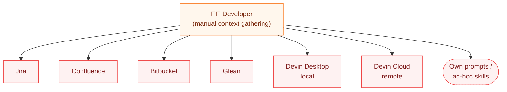
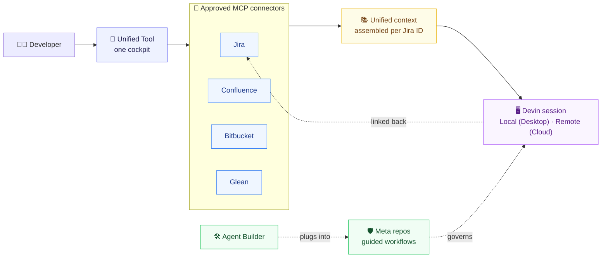
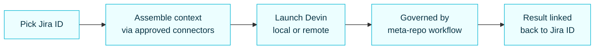

# Development Lifecycle — Current State vs New State

*High-level. Each section is a slide.*

---

## The problem: tool sprawl, unlinked sessions, no shared workflow

Development teams work across **Jira, Confluence, Bitbucket, Glean, Devin Desktop (local),
and Devin Cloud (remote)**. To code with Devin, a developer hops tool-to-tool to
hand-gather the context an agent needs. Sessions run **local or remote** but aren't linked
to the work item. And every developer brings **their own prompts, skills, and workflows**,
so no two runs are governed the same way.

**Pain points:** context scattered across tools · Devin sessions not linked to Jira ·
local vs remote is a manual choice · inconsistent, ungoverned prompts and workflows.

---

## The shift: one unified tool, governed and Jira-linked

A single tool sits between the developer and everything else. It gathers context through
**approved MCP connectors**, starts a **Jira-linked Devin session** (local or remote),
**governs** that session with shared meta-repo workflows, and lets teams **build agents**
that plug into those workflows.

---

## Four capabilities of the unified tool

| # | Capability | What it resolves |
|---|------------|------------------|
| 1 | **Unified context** — approved MCP connectors pull from Jira · Confluence · Bitbucket · Glean | No more hopping tool-to-tool; context is assembled in one place |
| 2 | **Jira-linked Devin sessions** — start from a Jira ID; run **Local (Desktop)** or **Remote (Cloud)**; session links back to the ticket | Work is tracked; local/remote is a toggle, not a disconnect |
| 3 | **Governed workflows** — meta repos embed the guided process every session follows | Every team develops the same way; governance is built in, not optional |
| 4 | **Agent Builder** — create agents that integrate into the workflows | Extend the guided process with new, reusable agents |

---

## Side-by-side

| Dimension | Current state | New state (unified tool) |
|-----------|---------------|--------------------------|
| **Context** | Hand-gathered across Jira/Confluence/Bitbucket/Glean | One layer via **approved MCP connectors** |
| **Work tracking** | Jira separate from the coding session | **Jira ID linked** to each Devin session |
| **Where dev runs** | Local *or* remote, chosen and wired manually | **Local (Desktop) or Remote (Cloud)** from the same cockpit |
| **Consistency** | Everyone's own prompts / skills / workflows | **Meta-repo guided workflows**, shared across teams |
| **New capabilities** | Built ad-hoc, per person | **Agent Builder** produces agents that plug into workflows |
| **Traceability** | None across tools | Jira ID ↔ session ↔ actions, audited |

---

## The through-line: Jira → context → governed session → traceable outcome

---

## Outcome

- **One place**: gather context and start development without leaving the tool.
- **Tracked**: every Devin session — local or remote — is tied to its Jira ID.
- **Consistent**: meta-repo workflows give every team the same guided, governed process.
- **Extensible**: Agent Builder adds new agents that slot into those workflows.
