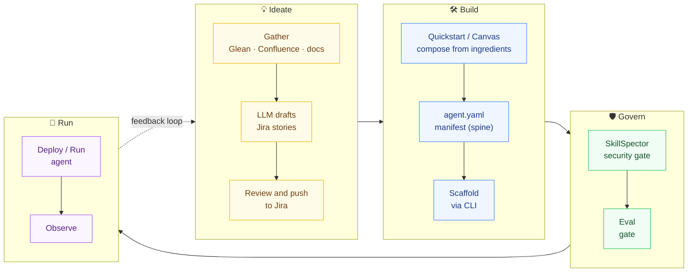
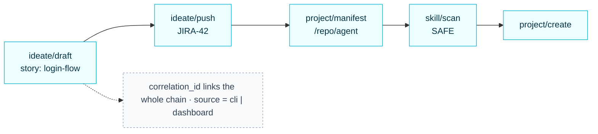

# Development Lifecycle — Current State vs New State

*High-level. Each section is a slide.*

---

## The problem: today's cycle is manual and siloed

Requirements live in people's heads and scattered docs. Tickets are written by hand.
Agents/services are hand-built per project. Skills and tools are wired ad-hoc with no
security check. Testing is informal, and there is **no single trail** linking a
requirement to the code that shipped.

```mermaid
flowchart LR
  R["Requirements<br/>meetings · wiki · email"] --> P["PM hand-writes<br/>Jira stories"]
  P --> D["Devs interpret<br/>tickets"]
  D --> C["Hand-write agent/service<br/>code per project"]
  C --> W["Manually wire<br/>skills · tools · MCP"]
  W --> T["Ad-hoc local<br/>testing"]
  T --> Y["Manual<br/>deploy"]
  Y -. "no unified trail" .-> Q(["❓ traceability gap"])

  classDef pain fill:#fef2f2,stroke:#ef4444,color:#7f1d1d;
  classDef gap fill:#fff7ed,stroke:#f97316,color:#7c2d12,stroke-dasharray:4 3;
  class R,P,D,C,W,T,Y pain;
  class Q gap;
```

**Pain points:** slow hand-offs · inconsistent scaffolding · unvetted third-party skills ·
no eval gate · no audit / no way to link an action back to its origin.

---

## The shift: a guided, composable, audited lifecycle

The platform reshapes the cycle into four phases — **Ideate → Build → Govern → Run** —
each backed by real tooling, with the **CLI as the engine and auditor** underneath.

---

## Side-by-side

| Phase | Current state | New state (platform) |
|-------|---------------|----------------------|
| **Requirements** | Meetings, scattered docs, manual tickets | **Ideate**: gather from Glean/Confluence/docs → LLM-drafted stories → review → push to Jira |
| **Build** | Hand-written per project | **Quickstart / Canvas** compose from Models · Tools · Retrievers · Skills · MCP; `agent.yaml` manifest; CLI scaffold |
| **Compose** | Ad-hoc skill/tool wiring | First-class **ingredients** + editable **Project Canvas** |
| **Govern** | None / informal review | **SkillSpector** security gate on install + **Eval** gate before "done" |
| **Run** | Manual deploy | Deploy/run agents, tracked |
| **Audit** | No unified trail | **CLI audit trail** — every action recorded, attributable, and linkable across features |

---

## The through-line: one audited chain

Because the CLI records every consequential action with a **correlation id**, a single
requirement can be traced end-to-end — from the story it produced to the project that
shipped it.

---

## Outcome

- **Faster**: requirements → running agent without manual hand-offs.
- **Safer**: no unvetted skill ships; nothing is "done" until eval passes.
- **Consistent**: every agent composed from the same governed ingredients + manifest.
- **Accountable**: one audit trail links every action to its origin and to each other.
