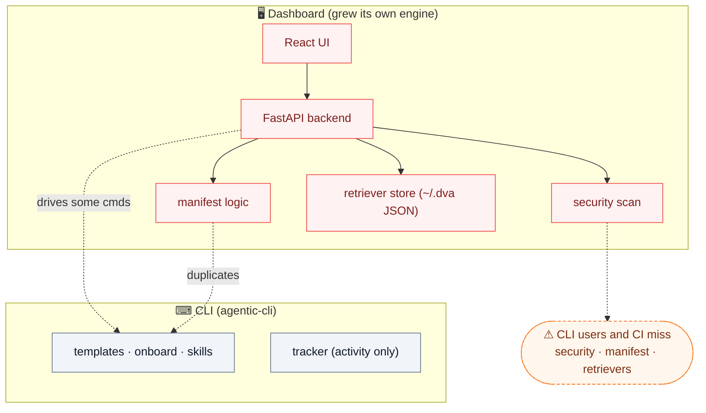
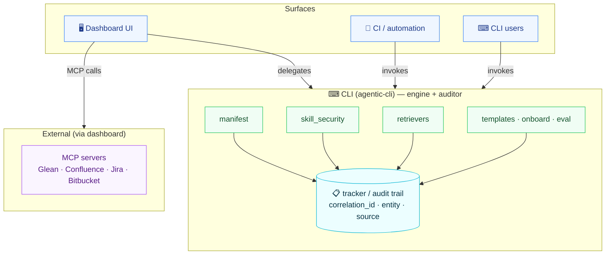
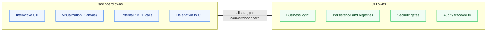

# Architecture — Current State vs New State

*High-level. Each section is a slide.*

---

## Principle

> **The CLI is the heart of all logic and the central auditor.**
> **The dashboard is a lens** — for interactive work and external (MCP) integrations.
> Every surface calls the CLI; every consequential action is audited.

---

## Current state — logic drifting into the dashboard

As features shipped quickly, engine logic and state landed in the **dashboard**, creating
a parallel implementation. CLI users and CI didn't benefit, and there was no shared audit.

**Symptoms:** duplicated logic · dashboard-only capabilities · no cross-feature audit ·
the manifest (meant to be the spine) understood only by the browser.

---

## New state — CLI-first, dashboard as a lens

Engine logic moves into the CLI. The dashboard delegates and is tagged `source="dashboard"`.
The **tracker becomes the auditor**, linking actions across features.

---

## What moved (parity delivered)

| Capability | Current (drift) | New (CLI-first) |
|------------|-----------------|-----------------|
| **Manifest** | dashboard derives/writes `agent.yaml` | `dva project manifest` — dashboard delegates |
| **Security** | dashboard-only scan + CI script | `dva skill scan` + **gate in `dva skill install`** — dashboard delegates |
| **Retrievers** | dashboard-only JSON store | `dva retriever …` registry — dashboard delegates |
| **Audit** | activity log only | `activity_log` + **correlation_id / entity / source**; `record_action`, `get_action_chain`; `dva history` shows Source |

---

## Division of responsibility

