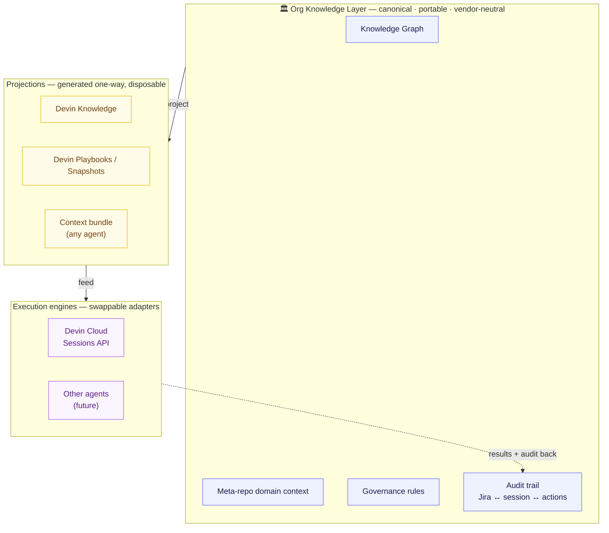
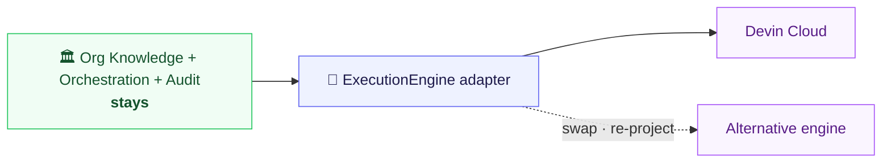
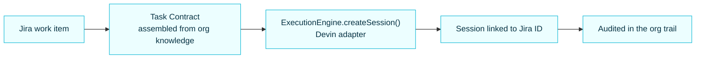

# Vendor-Neutral Orchestrator — Knowledge That Outlives the Vendor

*Positioning. The durable thesis behind the platform.*

---

## The thesis

> **The organization owns the knowledge and the workflow. The coding engine is a
> replaceable execution provider.**

Coding agents are excellent and evolving fast — but if your **context, governance, and
history live inside a vendor** (e.g. a vendor's "Knowledge" store, playbooks, snapshots),
then **switching or losing that vendor loses your institutional knowledge with it.**

The platform's job is to keep the durable layer — knowledge, governance, audit — at the
**org level**, and use the vendor (Devin today) purely as a **cloud-native execution
engine** behind a swappable adapter.

---

## The durability model

**Rule:** knowledge is **authored in the org layer** and **projected** into the vendor.
Nothing of record is authored *only* inside the vendor — so projections are disposable.

---

## What survives if the vendor changes

Swap the adapter, re-project the knowledge — the org keeps its context, governance, and
history intact.

---

## The execution flow (unchanged for the user, neutral underneath)

The developer experience is identical; only the layer *underneath* the adapter is
vendor-specific.

---

## Built vs. roadmap (honest state)

| Capability | State | Notes |
|------------|-------|-------|
| Org knowledge layer (KG + meta-repo + governance) | ✅ Built | Canonical, portable, org-owned |
| Jira work item → Task Contract → Devin session, linked | ✅ Built | `workflow_service` + `StartWorkDialog` + `createDevinSession` |
| Cross-feature audit (correlation_id · source) | ✅ Built | `tracker` / `record_action` |
| **ExecutionEngine adapter (swappable)** | ✅ Built | `agentic_cli.execution` seam; Devin is one adapter; dashboard routes through it (`source="dashboard"`) |
| **Canonical → Devin projection, one-way** | ✅ Built | `push-devin` is idempotent + versioned; each entry carries a provenance footer |
| **Provenance + drift status (no Devin-only authoring)** | ✅ Built | `keel kg okf project-status`: `okf://…` source refs + `in_sync/drift/unprojected/orphan`; surfaced as a per-bundle badge in the UI |
| **Portable context bundle (non-Devin agents)** | ✅ Built | `local` execution engine + `keel context build`: renders CONTEXT.md + prompt.md + manifest.json (provenance) for Claude Code / Codex / any agent — no API key |
| **Enterprise auth (SSO / RBAC / actor audit)** | ✅ Built | Forward-auth provider trusts an SSO proxy's verified identity; RBAC blocks unauthorized actions (403); the authenticated **actor** is written to the audit trail. `keel auth whoami/roles/check`. *Eval-phase; PROD hardening tracked in [`04`](04-enterprise-auth.md) (streamed-push actor attribution, managed role source, secret rotation).* |

### Enterprise auth without running an IdP

We don't operate an identity provider — and enterprises rarely want the login flow *in* the
app. The app sits behind an **SSO reverse proxy** (oauth2-proxy / Okta / Azure AD / Cloudflare
Access) that performs the OIDC/SAML handshake and injects a verified identity header; a swappable
`AuthProvider` trusts it (mirroring the execution seam):

| Provider | When | Identity source |
|----------|------|-----------------|
| `dev` | local / default | env principal (defaults to admin — no lockout) |
| `forward-auth` | production | SSO proxy's verified headers, gated by a shared secret |

- **RBAC is enforced, not advisory.** Roles (`viewer < developer < maintainer < admin`) map to
  permissions; sensitive actions (`session:create`, `knowledge:project`, `knowledge:delete`,
  `context:build`) are blocked at the API with **403** when the principal lacks them.
- **Trusted headers can't be spoofed.** Forward-auth is opt-in (`KEEL_AUTH_MODE=forward-auth`) and,
  when `KEEL_FORWARD_AUTH_SECRET` is set, a shared secret the proxy injects must match — a client
  bypassing the proxy is treated as anonymous.
- **The actor is audited.** Every gated action records *who* did it (`actor` column, schema v13)
  alongside `source` — the CLI stays the central auditor across CLI and dashboard.
- **Single provider swap.** The dashboard's identity seam (`UserContext`) hydrates from
  `/api/auth/me`; call sites use `useUser()`/`can()` unchanged. Deployment: see
  [`04-enterprise-auth.md`](04-enterprise-auth.md).

### The seam is demonstrably multi-engine

`keel execution list` now shows **two** engines behind the same neutral `ExecutionSpec`:

| Engine | Kind | Needs a key? | Produces |
|--------|------|--------------|----------|
| `devin` | cloud | yes (`DEVIN_API_KEY`) | a Devin Cloud session |
| `local` | local | **no** | a portable context bundle any agent can consume |

The *same* task spec, routed to a different engine, yields either a Devin session or a
vendor-free bundle (`CONTEXT.md` + `prompt.md` + `manifest.json` with provenance). Switch with
`KEEL_EXECUTION_ENGINE` or `--engine local` — proof that the org owns the context and the
engine is swappable, not aspirational. In the dashboard, "Start work" offers a third path —
**Render context** — that previews and downloads the same bundle for a Jira task.

### What "canonical → projection" now guarantees, concretely

- **One source of truth.** Knowledge is authored in the OKF bundle (KG + meta-repo). The
  Devin Knowledge panel is labelled a *projection* — a regenerable copy, not an edit surface.
- **Provenance.** Every projected entry points back at `okf://<domain>/<concept_id>` and
  carries a content-hash + version footer, so any Devin entry is traceable to its canonical origin.
- **Drift is observable at a glance.** `keel kg okf project-status` (and the per-bundle badge)
  compares the live bundle against the recorded projection — *without* calling Devin — and flags
  `drift` (canonical changed), `unprojected` (never sent), and `orphan` (source concept deleted).
- **Regenerable.** Delete every entry in the vendor and re-project; swap the engine and the
  knowledge comes with you. The vendor holds a copy, never the original.

---

## Why this is defensible (vs. leaning on the vendor's own features)

Devin Cloud already offers Knowledge, Playbooks, a Jira-aware Sessions API, MCP, and
enterprise controls — so **competing on those loses to the vendor's roadmap.** The
durable, org-level value the vendor *cannot* own for you:

1. **Portability** — your knowledge and history are not hostage to one vendor.
2. **Cross-tool governance & audit** — one trail across Devin *and* any other agent/tool.
3. **Neutral orchestration** — route work to the best engine per task without re-platforming.

The platform is the **front door and the memory**; the vendor is the **hands**.
