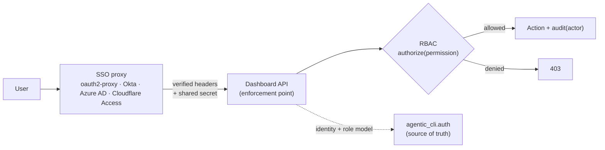

# Enterprise Auth — SSO via forward-auth, enforced RBAC, audited actor

*How the platform authenticates and authorizes without running its own identity provider.*

---

## The shape

We do **not** operate an IdP, and we do not put an OIDC/SAML login flow in the app. Instead the
app runs behind an **SSO reverse proxy** that already does the handshake and injects a *verified*
identity header. A swappable `AuthProvider` (in `agentic_cli.auth`) trusts that header, and the
dashboard enforces RBAC on top of it.



The proxy is the only thing that talks OIDC/SAML. Swap Okta for Azure AD and **nothing in the app
changes** — same headers, same seam.

---

## Providers

| Provider | Activated by | Identity source |
|----------|--------------|-----------------|
| `dev` | default | `KEEL_DEV_USER` / `KEEL_DEV_ROLES` env (defaults to `dev@local` as **admin** — no lockout in local/CI) |
| `forward-auth` | `KEEL_AUTH_MODE=forward-auth` | the SSO proxy's verified headers |

`resolve_provider()` picks by `KEEL_AUTH_MODE`; the dashboard resolves the principal per request
from headers, the CLI from env (`keel auth whoami`).

---

## RBAC

Roles are ordered and grant a fixed permission set:

| Role | Permissions |
|------|-------------|
| `viewer` | (read-only) |
| `developer` | `context:build`, `session:create` |
| `maintainer` | + `knowledge:project`, `knowledge:delete` |
| `admin` | `admin:*` (all) |

Enforced (HTTP **403**) on: create session, project knowledge to Devin (live), delete Devin
knowledge, render portable context. Read-only surfaces need no permission.

---

## Deploying behind oauth2-proxy (example)

Configure the proxy to pass identity headers and a shared secret, then set the app's env:

```bash
# App (dashboard backend) environment
KEEL_AUTH_MODE=forward-auth
KEEL_FORWARD_AUTH_SECRET=<random-secret-also-set-on-the-proxy>   # anti-spoofing
KEEL_ROLE_MAP=eng-admins:admin,platform-maintainers:maintainer,engineers:developer
KEEL_DEFAULT_ROLE=developer          # authenticated users with no mapped group
KEEL_ADMIN_EMAILS=cto@corp.com       # optional explicit admins
```

Headers consumed (oauth2-proxy defaults; common fallbacks also accepted):

| Header | Meaning |
|--------|---------|
| `X-Auth-Request-Email` | subject (identity) |
| `X-Auth-Request-Preferred-Username` / `X-Auth-Request-User` | display name |
| `X-Auth-Request-Groups` | groups → mapped to roles via `KEEL_ROLE_MAP` |
| `X-Auth-Proxy-Secret` | must equal `KEEL_FORWARD_AUTH_SECRET`, else the request is anonymous |

> **Security invariant:** the app must be reachable **only** through the proxy. The shared-secret
> gate enforces this — a client that reaches the app directly cannot present the secret and is
> treated as unauthenticated (401), so identity headers cannot be spoofed.

---

## Audit

Every gated action records the **actor** (authenticated subject) next to `source` (`cli` /
`dashboard`) in the central audit trail (`activity_log.actor`, schema **v13**). The CLI remains the
auditor across both surfaces — "who did what, from where" is answerable for every sensitive action.

---

## Glean SSO (reuses this identity layer)

Glean can authenticate two ways under SSO — both live today:

| Mode | Config | Token used |
|------|--------|------------|
| **Service token** (client-credentials) | `keel init glean --sso --issuer <> --client-id <> --client-secret <>` | Minted from the IdP (OIDC discovery → `token_endpoint`), cached in-process |
| **On-behalf-of** (per-user) | `keel init glean --sso --issuer <> --client-id <>` (no secret) | The **signed-in user's** access token, forwarded by the SSO proxy |

For on-behalf-of, configure the SSO proxy to pass the user's access token
(oauth2-proxy: `--pass-access-token`, header `X-Auth-Request-Access-Token`).
The dashboard forwards it to Glean, which applies that user's document
permissions — mirroring the per-user IDE plugin. Glean requests carry
`X-Glean-Auth-Type: OAUTH` so the token is treated as an OAuth token. Verify
with `keel glean status` / `keel doctor`.

## Inspecting from the CLI

```bash
keel auth whoami                 # resolved identity, provider, roles, permissions
keel auth roles                  # role → permission matrix
keel auth check knowledge:project  # exit 0 if permitted, 1 otherwise
```

---

## Evaluation-phase scope & future PROD hardening

This is built for the **evaluation phase**. The access decision (403) is fully enforced today;
the items below are deferred to a production hardening pass:

- **Actor attribution on the streamed OKF push.** `keel kg okf push-devin` runs as a streamed CLI
  subprocess, so its audit rows are attributed to the CLI principal rather than the dashboard user.
  The **route is RBAC-enforced** (`knowledge:project`), but per-row actor attribution for that
  streamed path needs the actor threaded into the subprocess environment. *(Future / PROD.)*
- **Group/role source of truth.** Role mapping is env-driven (`KEEL_ROLE_MAP`); PROD may prefer a
  managed mapping (directory groups / SCIM) with periodic refresh.
- **Session/secret handling.** Session-scoped vendor secrets and token lifetimes are delegated to
  the SSO proxy today; PROD should define rotation + per-session secret binding.

These do not affect the evaluation-phase guarantees: identity is resolved by the provider, sensitive
actions are blocked with 403, and the actor is audited for every dashboard-initiated action.
