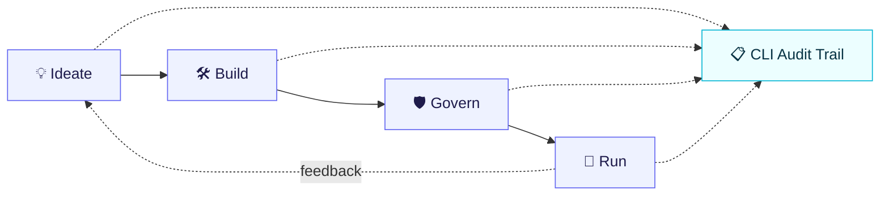

# Agentic Platform — Design & Presentation Set

A slide-ready design set for the **agentic development lifecycle**: how software (and
agents) get built on the platform, contrasted with the current manual process.

> **Reading order — high level first, then detail.**

## Contents

| # | Document | Level | What it shows |
|---|----------|-------|---------------|
| 01 | [Development Lifecycle](./01-development-lifecycle.md) | High | Current-state vs new-state dev cycle (flow) |
| 02 | [Architecture](./02-architecture.md) | High | Current-state vs new-state architecture (CLI-first) |
| — | [Slides — `slides/deck.html`](./slides/deck.html) | Deck | **Done** — professionally designed 7-slide deck (current → new) |
| 03 | Phase Detail — Ideate → Build → Govern → Run | Detail | *(planned)* per-phase flows + data |
| 04 | Audit & Traceability | Detail | *(planned)* how the CLI links actions across features |

## The deck

`slides/deck.html` is a **self-contained** presentation (no external assets, works offline).

- **Present:** open it in any browser. Navigate with **← / →** (or PageUp/Down, scroll).
  **Home/End** jump to first/last. The **Theme** button toggles light/dark.
- **Deep-link:** `deck.html#s5` opens directly on a given slide.
- **Slides:** 1 Cover · 2 Current lifecycle · 3 New lifecycle · 4 Current architecture ·
  5 New architecture (CLI-first) · 6 Audited chain · 7 Outcomes.

## How this maps to the deck

Each `##` heading in the high-level docs is authored to become **one slide**. Mermaid
blocks in 01–02 are the GitHub-rendered *source of truth*; the deck renders the same
structures as hand-designed architecture visuals.

## The core message

The platform turns a **manual, siloed, unaudited** development process into a
**guided, composable, fully-audited** lifecycle where the **CLI is the engine and the
auditor**, and the **dashboard is a lens** for interactive and external (MCP) work.

