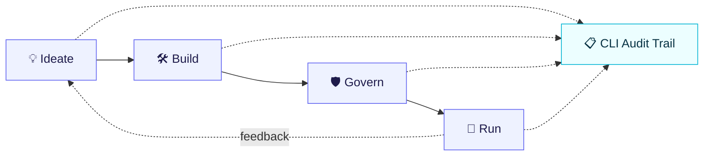

# Agentic Platform — Design & Presentation Set

A slide-ready design set for the **agentic development lifecycle**: how software (and
agents) get built on the platform, contrasted with the current manual process.

> **Reading order — high level first, then detail.**

## Contents

| # | Document | Level | What it shows |
|---|----------|-------|---------------|
| 01 | [Development Lifecycle](./01-development-lifecycle.md) | High | Current-state vs new-state dev cycle (flow) |
| 02 | [Architecture](./02-architecture.md) | High | Current-state vs new-state architecture (CLI-first) |
| 03 | Phase Detail — Ideate → Build → Govern → Run | Detail | *(planned)* per-phase flows + data |
| 04 | Audit & Traceability | Detail | *(planned)* how the CLI links actions across features |
| — | [Slides](./slides/) | Deck | *(planned)* professionally designed deck built from 01–04 |

## How this maps to a deck

Each `##` heading in the high-level docs is authored to become **one slide**. Mermaid
blocks are the *source of truth* for the diagrams; the polished deck (`slides/`) renders
the same structures as designed architecture visuals.

## The core message

The platform turns a **manual, siloed, unaudited** development process into a
**guided, composable, fully-audited** lifecycle where the **CLI is the engine and the
auditor**, and the **dashboard is a lens** for interactive and external (MCP) work.

